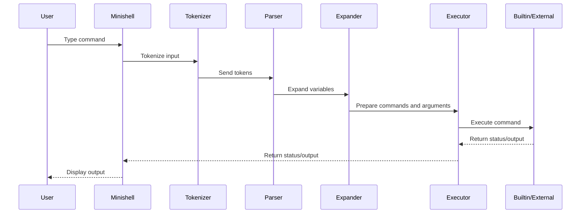

# minishell

This is a small Unix shell implementation (a 42-school style "minishell"). It implements a subset of typical shell features: parsing and tokenizing input, environment management, built-in commands, basic redirections, here-documents, and simple pipeline execution.

This README documents the project structure, features, build and run instructions, known limitations, and pointers to the main source files.

## Features

- Interactive prompt with readline support and history.
- Signal handling for Ctrl-C and ignored Ctrl-\ (SIGQUIT).
- Command tokenization and parsing (quotes, escapes, and simple operators).
- Environment variable handling and expansion (including in here-documents when appropriate).
- Built-in commands: `cd`, `pwd`, `echo`, `env`, `export`, `unset`, `exit`.
- Execution of external commands using fork/exec, with simple pipeline support.
- Redirections: input (`<`), output (`>`), append (`>>`), and here-doc (`<<`).
- Basic memory and resource cleanup between loop iterations.

## Requirements

- POSIX-like environment (Linux/macOS).
- GCC or Clang for building C sources.
- Make (uses the provided `Makefile`).
- The code uses the readline library; ensure `readline` (development headers) are installed. On Debian/Ubuntu: `libreadline-dev`.

## Build

From the project root run:

```sh
make
```

This compiles the project and produces the `minishell` executable according to the `Makefile` rules.

To clean build artifacts:

```sh
make fclean
```

## Run

Start the shell by running the produced binary from the repository root:

```sh
./minishell
```

The prompt will appear as:

	Arab Spring 🐣🐥 ->

Type commands as you would in a normal shell. Use Ctrl-D to exit (EOF), and Ctrl-C to interrupt the current input (sets exit status 130).

## Project layout

Key files and directories (top-level):

- `main.c` - program entry point, main loop, initialization, and basic executor dispatch for builtins.
- `main_utils.c` - helpers for freeing resources, handling EOF (Ctrl-D) and per-loop cleanup.
- `signals.c` - signal handlers for SIGINT and SIGQUIT.
- `Headers/minishell.h` - project-wide types, structs and prototypes.
- `tokenizer/` - tokenization logic: splitting the prompt into tokens while handling quotes and special characters.
- `parser/` - parser implementation that detects token types and prepares commands for execution.
- `expander/` - variable expansion, dollar handling and quote-aware expansion.
- `execution/` - command execution, redirection handling, pipeline creation, child process management, and here-doc support.
- `built-in/` - implementations of shell builtins (`cd`, `pwd`, `env`, `export`, `unset`, `exit`, `echo` etc.).
- `libft/` - small helper library used across the project (string utilities, lists) and `ft_printf`, `get_next_line` implementations.

Subdirectories under `execution/`:
- `HereDoc/` - here-document helpers and expansion handling.
- `redirection/` - functions to open files and set up redirections.

Examples of important source files:
- Builtins: `built-in/cd.c`, `built-in/pwd.c`, `built-in/unset.c`, `built-in/exit/exit.c`, `built-in/export/export.c`, `built-in/echo/echo_command.c`.
- Execution: `execution/execution.c`, `execution/child_process.c`, `execution/redirect_utils.c`, `execution/open_files.c`.
- Tokenizer/Parser: `tokenizer/tokenizer.c`, `parser/parser.c`, `tokenizer/token_utils.c`.

## Built-ins

The shell provides implementations for the following builtins. These are executed internally and do not spawn a new process:

- `cd [dir]` - change working directory.
- `pwd` - print current working directory.
- `echo [-n] [args...]` - display arguments to stdout; supports `-n` to omit newline.
- `env` - print the current environment variables.
- `export [KEY=VALUE]` - add or modify environment variables.
- `unset KEY` - remove an environment variable.
- `exit [n]` - exit the shell with status `n` (or last exit status if omitted).

Builtin source code lives under `built-in/` and its subfolders. See `main.c` for how builtins are detected and dispatched.

## Signals

- Ctrl-C (SIGINT) interrupts the current input and sets the global `g_signal` and the shell exit status (130).
- Ctrl-\ (SIGQUIT) is ignored.

Signal handling is implemented in `signals.c` and is wired up during initialization.

## Testing and usage tips

- Test pipelines and redirections: `ls -l | grep src > out.txt`.
- Test here-documents: `cat << EOF` followed by lines and `EOF` on its own line.
- Test environment variable expansion: `echo $HOME` or `echo "$PATH"`.
- Use `export` to add variables used by child processes.

Edge cases to be mindful of (known complexity areas):

- Complex parsing with nested quotes or mixed quoting and escaping may have subtle differences from bash.
- Some positional parameter and subshell features are out of scope.
- Advanced job control (background `&`, fg/bg) and command substitution are not implemented (unless added elsewhere in the code).

## Development notes

- Memory management: most subsystems free their allocated data between loop iterations (`main_utils.c::free_loop`).
- Temporary files used for here-documents are unlinked via `unlink_files` after command execution.
- The project relies on the `libft` utilities for convenience functions; modifications there affect the whole project.

If you plan to extend or modify the shell, look at these hotspots first:

- `tokenizer/` and `parser/` - change how input is split and categorized.
- `expander/` - adjust variable expansion rules.
- `execution/` - add support for more complex redirections, background jobs, or better error handling.

## Sequence Diagram

The following Mermaid diagram shows **how minishell processes a command**:




### Contributors
- [@Oalananz](https://github.com/Oalananz)
- [@Qhatahet](https://github.com/Qhatahet)
